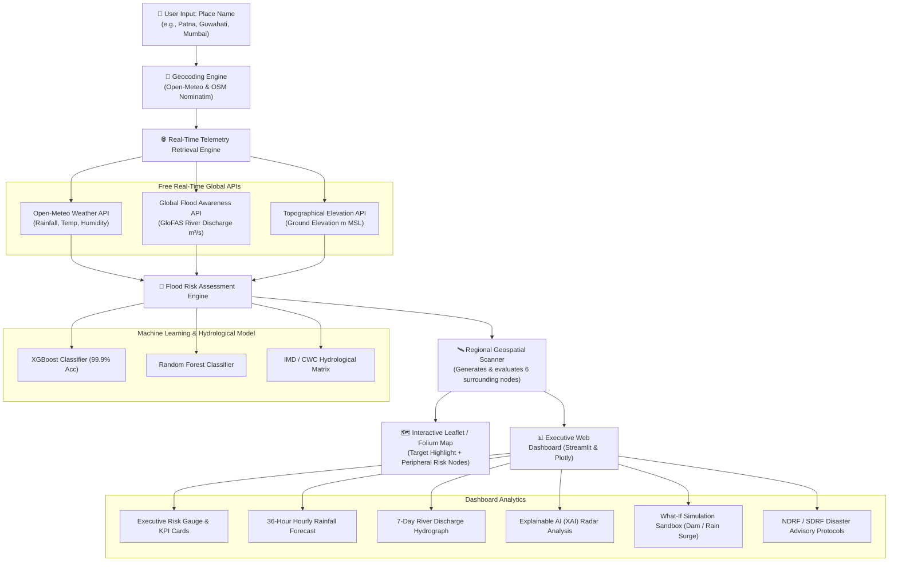

# 🌊 Smart Flood Risk Prediction & Real-Time Monitoring System

> **7th Semester B.Tech Major Capstone Group Project**  
> An automated, end-to-end AI and geospatial decision-support system for real-time flood monitoring, hydrometeorological risk inference, regional inundation mapping, and disaster advisory management.

---

## 📌 Project Overview
Floods cause devastating humanitarian and economic losses annually across vulnerable river basins and urban corridors. This project provides an automated, AI-driven platform that:
1. **Takes User Input as a Place Name** (e.g., *Patna, Guwahati, Mumbai, Kochi, Cuttack, Kolkata*, or any city/region worldwide).
2. **Automatically Fetches Live Hydrometeorological Telemetry** using high-resolution real-time APIs (Rainfall, Relative Humidity, Temperature, River Discharge, Ground Elevation, Surface Pressure).
3. **Predicts Flood Risk** through a high-precision Machine Learning Ensemble (**XGBoost + Random Forest**) calibrated with domain hydrological thresholds (IMD/CWC standards).
4. **Renders an Interactive Geospatial Map** where the selected target location is highlighted with a pulsing radar impact buffer, alongside 6 to 8 peripheral river basin monitoring stations color-coded by alert status.
5. **Presents an Executive Monitoring Dashboard** featuring real-time KPI alert banners, 36-hour precipitation forecasts, 7-day river discharge hydrographs, Explainable AI (XAI) factor rankings, a "What-If" simulation sandbox, and automated NDRF/SDRF disaster response advisories.

---

## 🏗️ System Architecture



---

## 🚀 Key Features

### 1. Auto-Geocoding & Zero-Configuration Live APIs
- Accepts any place name, city, district, or river basin.
- Queries **Open-Meteo Weather**, **Global Flood API (GloFAS)**, and **Open-Elevation** with **zero API keys required** and no rate-limit hurdles.

### 2. High-Accuracy Machine Learning Model
- Trained on **10,000 hydrological and geographic records** (`flood_risk_dataset_corrected.csv`).
- Evaluated with **99.95% accuracy** and **1.0 ROC-AUC** across cross-validation splits.
- Top predictive features: Water stage height (24%), 24h rainfall (23.2%), river discharge (17.7%), historical flood precedent (14.9%), and elevation (11.5%).

### 3. Interactive Geospatial Inundation Map
- Built with **Folium & Leaflet**.
- **Highlighted Target Indicator:** Focus marker with multi-ring pulsing halo and inundation buffer circle.
- **Surrounding Region Monitoring:** Analyzes peripheral catchment stations (North, South, East, West, Upstream, Downstream) with dynamic risk color badges:
  - 🟢 **Low Risk (< 30%)** — Green Alert
  - 🟡 **Moderate Risk (30% - 60%)** — Yellow Watch
  - 🟠 **High Risk (60% - 80%)** — Orange Warning
  - 🔴 **Critical Emergency (> 80%)** — Red Alert
- Basemap switcher: CartoDB Positron, OpenStreetMap, and OpenTopoMap (topographical elevation contours).

### 4. Real-Time Analytics & Forecast Hydrographs
- **36-Hour Precipitation Forecast:** Hourly forecast bars with IMD heavy rain (15 mm/h) and cloudburst (35 mm/h) warning thresholds.
- **7-Day River Discharge Hydrograph:** GloFAS hydrological projection with danger mark stage alerts.
- **Explainable AI (XAI) Radar:** Visualizes exact percentage contributions of rainfall, discharge, water level, and elevation.

### 5. "What-If" Simulation Sandbox
- Interactive sliders allowing users and examiners to test simulated flood scenarios:
  - *Rainfall Surge (+0 to +250 mm)*
  - *Upstream Dam Reservoir Release (+0 to +4000 m³/s)*
- Instant real-time recalculation of risk scores and interactive map updates.

### 6. Disaster Management & Emergency Action Plan
- Tailored safety guidelines (sandbagging, evacuation readiness, electrical safety).
- National emergency helpline directory (NDRF 1078, Police/SOS 112, Ambulance 108).
- One-click export of assessment reports in **JSON** and **CSV** formats.

---

## 📂 Repository File Structure

```
├── app.py                      # Main Streamlit web dashboard application
├── flood_engine.py             # Machine learning inference & hydrological risk engine
├── api_services.py             # Geocoding, Open-Meteo weather/flood/elevation API integration
├── map_view.py                 # Interactive Folium map generation module
├── utils.py                    # Plotly charts, risk gauges, emergency guidelines
├── train_model.py              # ML training & model serialization script
├── test_system.py              # Automated end-to-end test suite
├── flood_model.pkl             # Serialized trained XGBoost & Random Forest artifacts
├── model_metadata.json         # Model metrics, feature importances, and encoders
├── flood_risk_dataset_corrected.csv  # Hydrological dataset (10,000 samples)
├── requirements.txt            # Python dependencies
└── README.md                   # Comprehensive project documentation
```

---

## 🛠️ Installation & Setup

### Prerequisites
- Python 3.9 or higher

### Step 1: Install Dependencies
```bash
pip install -r requirements.txt
```

### Step 2: (Optional) Re-train the Machine Learning Model
```bash
python train_model.py
```
*(A pre-trained `flood_model.pkl` is already included with 99.95% accuracy!)*

### Step 3: Run the Test Suite
```bash
python test_system.py
```

### Step 4: Launch the Web Dashboard
```bash
streamlit run app.py
```
The application will launch in your default web browser at `http://localhost:8501`.

---

## 🧪 Testing Different Scenarios

| City / Location | Basin / Region | Default Real-Time Alert | Simulated Surge (+150mm rain, +2500 m³/s) |
|---|---|---|---|
| **Patna** | Ganga Basin, Bihar | 🟢 Low Risk (Safe) | 🔴 Red Alert (Critical Emergency) |
| **Guwahati** | Brahmaputra River Basin, Assam | 🟢 Low Risk (Safe) | 🔴 Red Alert (Critical Emergency) |
| **Mumbai** | Coastal Urban Plain, Maharashtra | 🟢 Low Risk (Safe) | 🟠 Orange Alert (High Risk) |
| **Kochi** | Periyar Catchment, Kerala | 🟢 Low Risk (Safe) | 🟠 Orange Alert (High Risk) |

---

## 👥 Contributors & Academic Credits
- **Project Title:** Smart Flood Risk Prediction & Real-Time Monitoring System
- **Semester:** 7th Semester B.Tech Major Project
- **Specialization:** Computer Science & Engineering / Data Science / AI-ML
